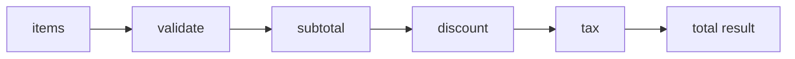

# HLD - Python 发票汇总函数

## 架构

该仓库采用纯 Python 标准库实现。核心逻辑位于 `src/ledger_totals.py`，测试位于 `tests/test_ledger_totals.py`。

```mermaid
flowchart LR
    A["items"] --> B["validate"]
    B --> C["subtotal"]
    C --> D["discount"]
    D --> E["tax"]
    E --> F["total result"]
```

## 边界

- 不引入第三方依赖。
- 不实现持久化。
- 不实现命令行界面。

